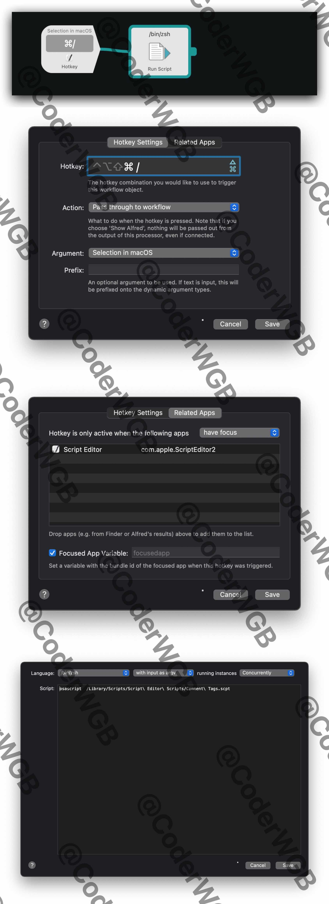

<!-- * [关于AppleScript的一些应用总结](Mac技巧/关于AppleScript的一些应用总结.md)
* [为Mac自带的AppleScript脚本编辑器增加代码注释快捷键](Mac技巧/为Mac自带的AppleScript脚本编辑器增加代码注释快捷键.md)
* [关于AppleScript脚本语言的一些使用总结](Mac技巧/关于AppleScript脚本语言的一些使用总结.md) -->

苹果`AppleScript`编辑器拓展代码注释快捷键，采用`Alfred+bash Shell`调用苹果自己的脚本实现一个工作流小工具。具体操作如图：

