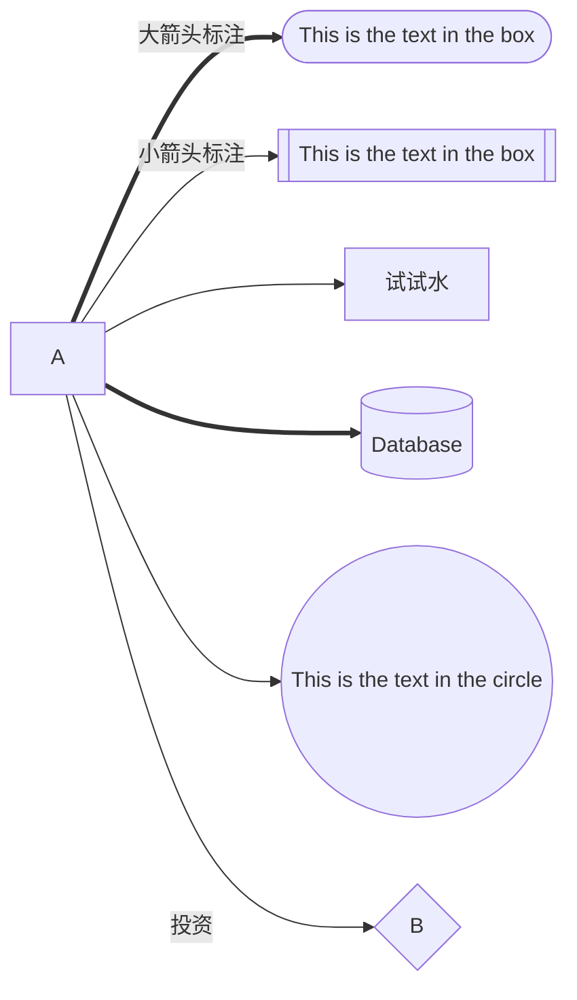

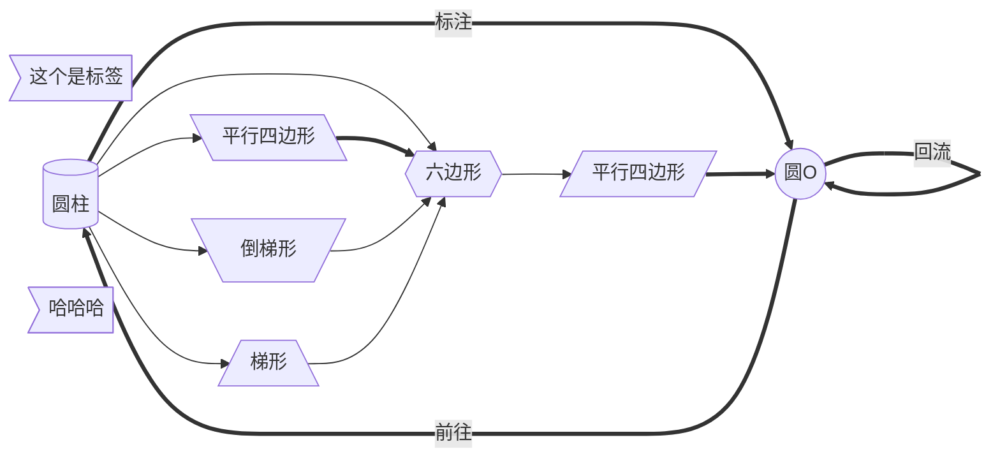

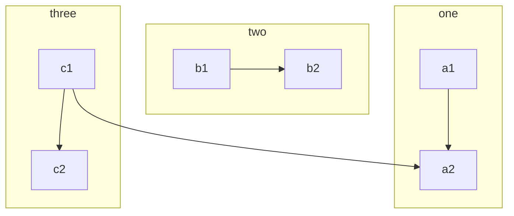


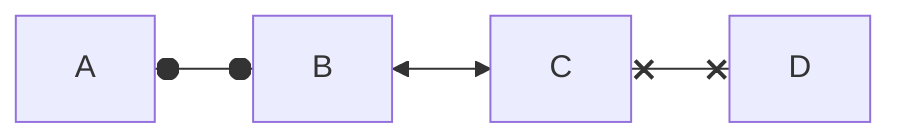

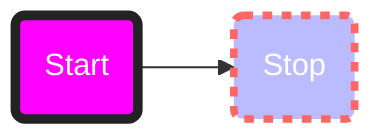

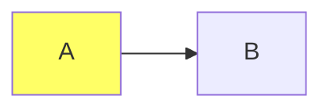

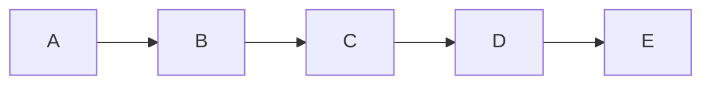


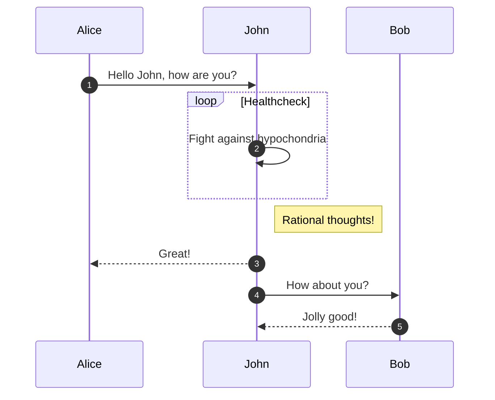


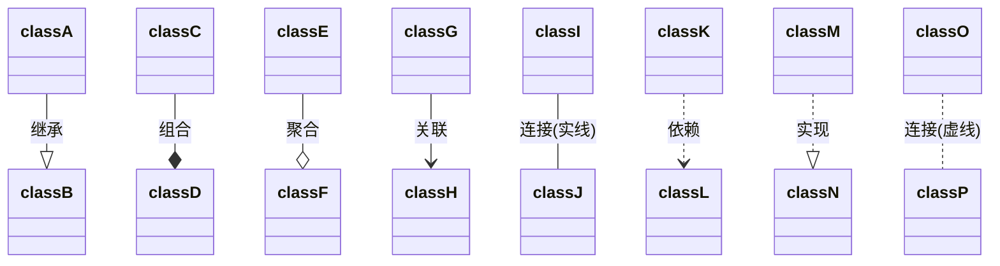

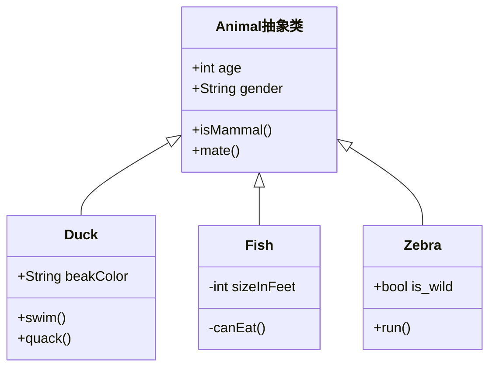

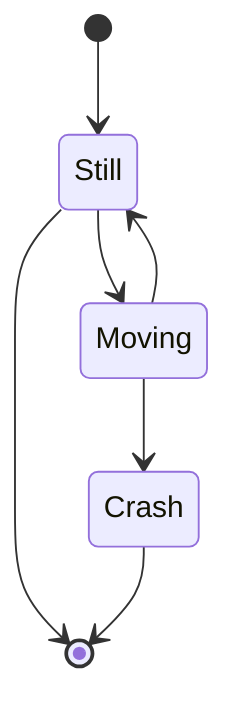

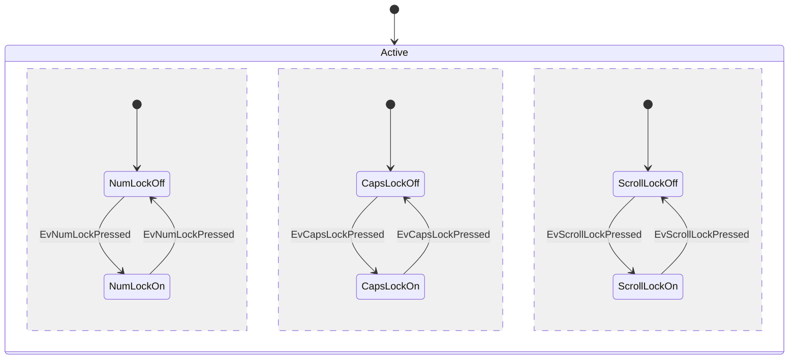

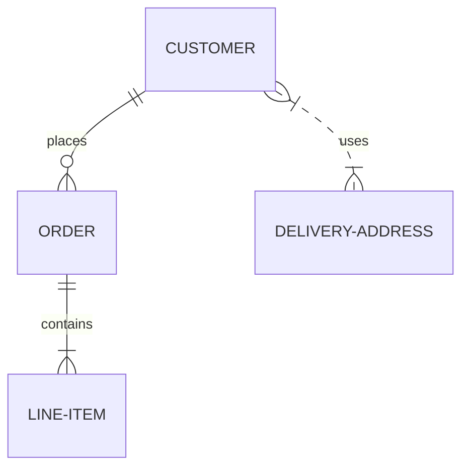

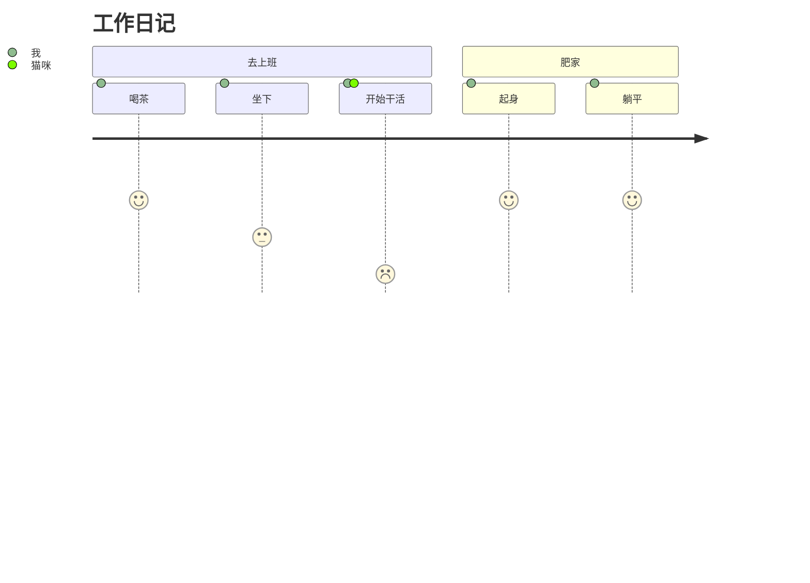

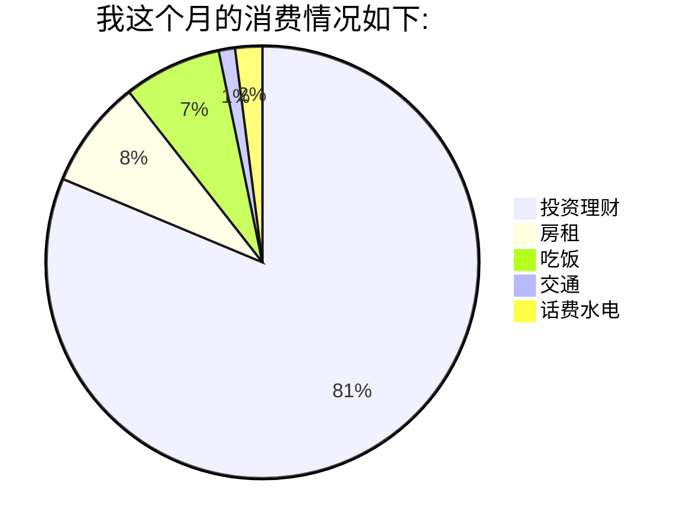


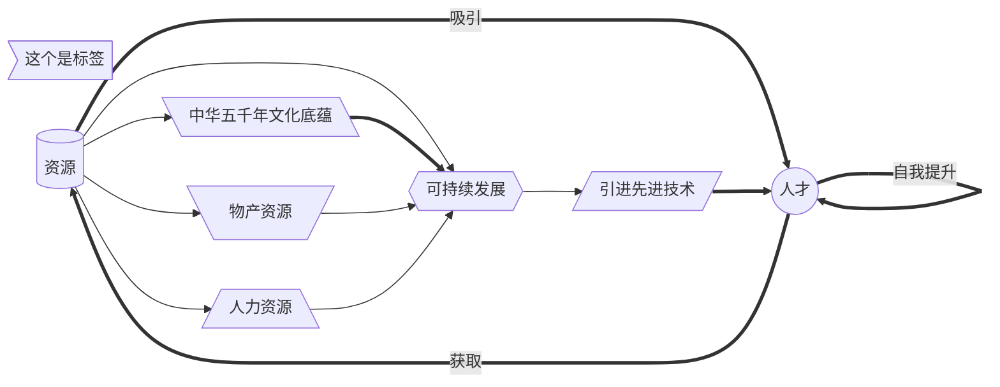


```mermaid
graph LR
    A:::customClass --> B
    classDef customClass fill:#ff6;
```

```mermaid
graph LR;
    A-->B;
    B-->C;
    C-->D;
    D-->E;
    
    click A "https://www.baidu.com" _blank
    click B "https://www.baidu.com" _blank
    click C "https://www.baidu.com" _blank
    click D "https://www.baidu.com" _blank
```


```mermaid
sequenceDiagram
    autonumber
    Alice->>John: Hello John, how are you?
    loop Healthcheck
        John->>John: Fight against hypochondria
    end
    Note right of John: Rational thoughts!
    John-->>Alice: Great!
    John->>Bob: How about you?
    Bob-->>John: Jolly good!
```


```mermaid
classDiagram
classA --|> classB : 继承
classC --* classD : 组合
classE --o classF : 聚合
classG --> classH : 关联
classI -- classJ : 连接(实线)
classK ..> classL : 依赖
classM ..|> classN : 实现
classO .. classP : 连接(虚线)
```

```mermaid
classDiagram
    Animal抽象类 <|-- Duck
    Animal抽象类 <|-- Fish
    Animal抽象类 <|-- Zebra
    Animal抽象类 : +int age
    Animal抽象类 : +String gender
    Animal抽象类: +isMammal()
    Animal抽象类: +mate()
    class Duck{
      +String beakColor
      +swim()
      +quack()
      }
    class Fish{
      -int sizeInFeet
      -canEat()
      }
    class Zebra{
      +bool is_wild
      +run()
      }
```

```mermaid
stateDiagram-v2
    [*] --> Still
    Still --> [*]

    Still --> Moving
    Moving --> Still
    Moving --> Crash
    Crash --> [*]
```

```mermaid
stateDiagram-v2
    [*] --> Active

    state Active {
        [*] --> NumLockOff
        NumLockOff --> NumLockOn : EvNumLockPressed
        NumLockOn --> NumLockOff : EvNumLockPressed
        --
        [*] --> CapsLockOff
        CapsLockOff --> CapsLockOn : EvCapsLockPressed
        CapsLockOn --> CapsLockOff : EvCapsLockPressed
        --
        [*] --> ScrollLockOff
        ScrollLockOff --> ScrollLockOn : EvScrollLockPressed
        ScrollLockOn --> ScrollLockOff : EvScrollLockPressed
    }
```

```mermaid
erDiagram
    CUSTOMER ||--o{ ORDER : places
    ORDER ||--|{ LINE-ITEM : contains
    CUSTOMER }|..|{ DELIVERY-ADDRESS : uses
```

```mermaid
journey
    title 工作日记
    section 去上班
      喝茶: 5: 我
      坐下: 3: 我
      开始干活: 1: 我, 猫咪
    section 肥家
      起身: 5: 我
      躺平: 5: 我
```

```mermaid
pie
    title 我这个月的消费情况如下:
    "投资理财" : 20000
    "房租" : 2000
    "吃饭" : 1800
    "交通" :  300
    "话费水电": 500
```


```mermaid
graph TD
A[家长端魔聊] -->|iOS开发| B(聊天功能)
B --> C{语音功能}
C --> |讲英文| D[直接发送]
C --> |中文语音| E(识别中文)
C --> |打字| F[直接发送]
C --> |发图| G[直接发送]
E --> |翻译成英文| H(合成大圣发音记录)
H --> |跟读英文| I{评测}
I --> |通过| K(发送消息)
I --> |不通过| L(保存记录)
```


